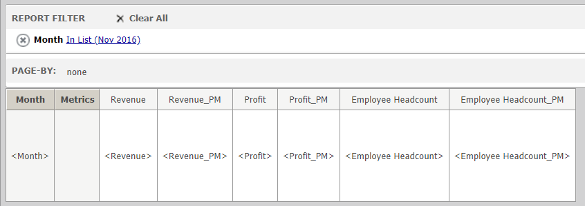

MicroStrategy Siri Integration
====================================

This project shows integraton between MicroStrategy and Siri using Sirikit and Intent app extension. This creates an action to be used in Siri Shorcuts.

[Video of the app running](https://youtu.be/SQhrmbCUN20)

1. Create a report in MicrStrategy Tutorial Project with the following structure, each metric added should have a previous month transformation renamed to metric+"_PM":

1. Modify the ViewController.swift and change the value of the constants username, password, loginMode, baseMSTRURL, reportID and projectID to the ones specific to your MicroStrategy Project.
1. Compile and run the app.
1. Create a Siri Shorcut using the donated action.
